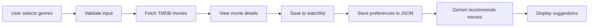

# CinemaMatch

## Project Overview

CinemaMatch is a Python-based movie recommendation system built with Streamlit, Gemini and TMDB API. It helps users discover movies based on their favorite genres, view details about each title, save movies to a personal watchlist, and receive AI-powered recommendations tailored to their preferences.

## Aim

The project aims to simplify movie selection by combining user preferences, external movie data, and artificial intelligence. It demonstrates practical application of Python, API integration, validation, file storage, UI design, and collaborative software development.

## How it works

1. The user opens the Streamlit app and selects one or more genres.
2. The app validates the input and stores the user’s preferences.
3. TMDB is queried for movies matching those genres.
4. The user can view movie details and add films to a watchlist or watched list.
5. The saved preferences and watchlist are sent to Gemini AI for personalized recommendations.
6. The app displays the AI-generated suggestions with short explanations.

## Tools and Technologies

- Python
- Streamlit
- TMDB API
- Google Gemini AI
- JSON file storage
- pytest
- Git and GitHub

## Setup

1. Create a `.env` file from `.env.example`.
2. Add your API keys:

```env
TMDB_API_KEY=your_tmdb_key
GEMINI_API_KEY=your_gemini_key
```

3. Install the requirements:

```bash
pip install -r requirements.txt
```

4. Run the app:

```bash
streamlit run app.py
```

5. Run tests:

```bash
python -m pytest -q
```



## Expected Outcome

At the end of the project, the app should provide a smooth and interactive movie discovery experience. It will show how software engineering concepts such as modular design, external API integration, data persistence, AI recommendations, and teamwork can be combined into a functional application.
